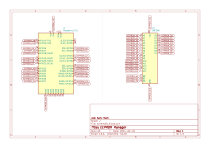

# EEPROM Manager

See what is in your EEPROM or select a file and dump it into its memory.

## Hardware

This project is created for working on a Raspberry Pi 5, and the used EEPROM is an ATMEL AT28C256
